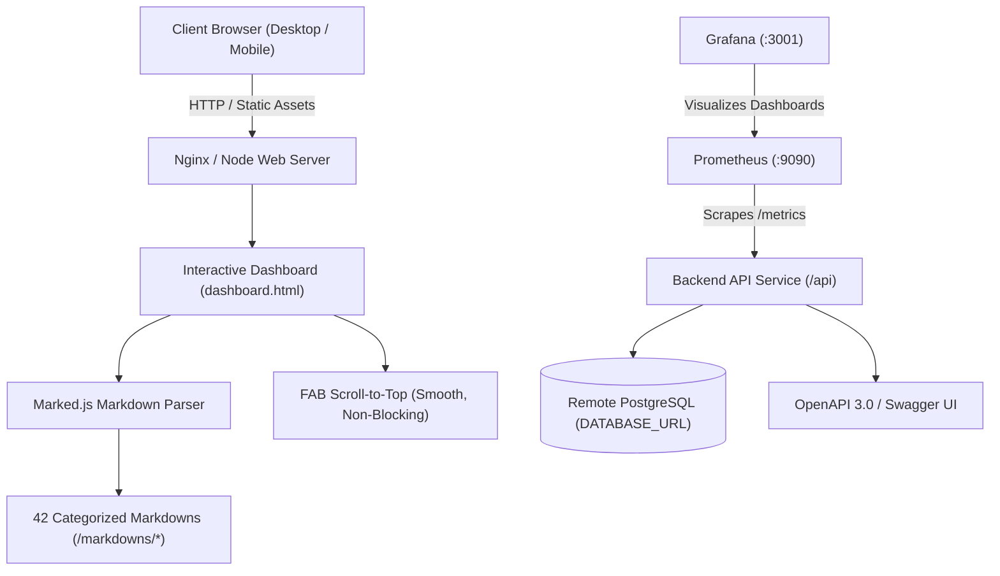

# 🚀 Interview Guide & Technical Knowledge Platform

[](file:///Users/santoshdevmane/github/interview-guide/docker-compose.production.yml)
[](file:///Users/santoshdevmane/github/interview-guide/docker/prometheus/prometheus.yml)
[](file:///Users/santoshdevmane/github/interview-guide/docker/grafana/provisioning/dashboards/dashboards.yml)
[](file:///Users/santoshdevmane/github/interview-guide/init.sql)
[](#content-coverage)
[](file:///Users/santoshdevmane/github/interview-guide/docs/swagger.json)

An enterprise-grade, comprehensive interview preparation and technical mastery platform featuring **42 specialized categories** with **100+ deep, production-tested Questions and Answers per technology**, verified code examples, responsive web UI with smooth non-blocking Floating Action Navigation, and full production observability.

---

## 📋 Table of Contents

- [Overview](#-overview)
- [Architecture & Design System](#-architecture--design-system)
- [Content Coverage (42 Categories / 4,200+ Questions)](#-content-coverage)
- [Directory Structure](#-directory-structure)
- [Database Schema (`init.sql`)](#-database-schema-initsql)
- [Observability (Prometheus & Grafana)](#-observability-prometheus--grafana)
- [API Documentation (Swagger & Postman)](#-api-documentation-swagger--postman)
- [Getting Started & Local Execution](#-getting-started--local-execution)
- [Docker Compose Deployment (Staging & Production)](#-docker-compose-deployment)
- [Engineering Guidelines: Dos and Don'ts](#-engineering-guidelines-dos-and-donts)
- [Contributing](#-contributing)
- [License](#-license)

---

## 🎯 Overview

The **Interview Guide Platform** is designed for software engineers, tech leads, engineering managers, and architects. Every question is curated to meet strict production standards:
- **Consistent Design Layout**: Modeled after the benchmark JavaScript golden template with centered logos, comprehensive 1-100 Table of Contents, difficulty badges (`Beginner`, `Intermediate`, `Advanced`, `Expert`), strategy explanations, and verified code examples.
- **Zero Duplicate Policy**: 100% of duplicate questions eliminated across all 42 categories.
- **Modern Web Application**: Interactive dashboard (`dashboard.html` / `index.html`) featuring fast client-side markdown parsing with Marked.js, search filters, theme toggles, and responsive **Floating Action Button (FAB) Scroll-to-Top**.

---

## 🏗️ Architecture & Design System



### Key Design Patterns
- **Golden Standard Layout**: Every markdown includes `<span class="beginner|intermediate|advanced">` tags, unique anchor links (`<a id="qX"></a>`), and structured metadata (`Difficulty`, `Strategy`, `Code Example`).
- **Responsive Floating Action Button**: Fixed `bottom-right` FAB with smooth multi-container tracking (`window`, `.main-content`, `#contentArea`) that remains completely non-blocking on mobile viewports.
- **Safe Hash Navigation**: Custom anchor handling in `assets/js/app-main.js` preventing invalid file fetches on anchor transitions.

---

## 📚 Content Coverage

The platform encompasses **42 categories**, each containing **at least 100 detailed questions and answers**:

| Domain | Categories | Questions Count |
| :--- | :--- | :--- |
| **Core Web & Frontend** | JavaScript, TypeScript, HTML5, CSS3, Tailwind & Bootstrap, Material/Radix UI | 603+ Qs |
| **Frontend Frameworks** | React.js, Next.js, Angular 14-18, Vue.js 3, Svelte & SvelteKit | 502+ Qs |
| **State Management** | NgRx, Redux Toolkit & Zustand | 200+ Qs |
| **Backend & Languages** | Node.js, Java & Spring Boot, Modern C++ (C++20/23), .NET 8 & C# 12, Rust 2024, Python & Django, Go (Golang) | 700+ Qs |
| **Mobile Development** | Swift & SwiftUI (iOS), Kotlin & Android, Flutter & Dart, React Native | 400+ Qs |
| **Cloud, DevOps & Arch** | Docker & Containers, Kubernetes, AWS Cloud, Microservices, Micro-frontends, System Design | 634+ Qs |
| **Data & APIs** | Database & SQL, GraphQL, Integration & Modern APIs, Web Performance, Application Security | 502+ Qs |
| **CS & Quality** | Algorithms, Data Structures, Git Version Control, Linux & Shell, Testing & QA | 500+ Qs |
| **Total** | **42 Categories** | **4,200+ Verified QnAs** |

---

## 📁 Directory Structure

```
interview-guide/
├── index.html                          # Landing page
├── dashboard.html                      # Interactive interview dashboard with 42 categories
├── styles.css                          # Core web styles
├── assets/
│   ├── css/
│   │   └── inline-styles.css           # Styling, FAB animations, and responsiveness
│   ├── js/
│   │   ├── app-main.js                 # App routing, safe hash scrolling, FAB button
│   │   └── marked.min.js               # Markdown parser
│   └── images/                         # Technology icons and logos
├── markdowns/                          # 42 Categories with 100+ QnAs each
│   ├── javascript/javascript-questions.md
│   ├── react/react-questions.md
│   ├── nextjs/nextjs-questions.md
│   ├── angular/angular-questions.md
│   ├── vue/vue-questions.md
│   ├── rust/rust-questions.md
│   ├── nodejs/nodejs-questions.md
│   ├── java/java-questions.md
│   ├── cpp/cpp-questions.md
│   ├── dotnet/dotnet-questions.md
│   └── ... (all 42 categories)
├── docker/
│   ├── prometheus/
│   │   └── prometheus.yml              # Prometheus scrape configuration
│   └── grafana/
│       └── provisioning/               # Grafana automated datasources and dashboards
├── docs/
│   ├── swagger.json                    # OpenAPI 3.0 API specification
│   └── postman_collection.json         # Postman API Collection
├── scripts/
│   ├── analyze_markdowns.py            # Master validation and audit script
│   ├── batch_base.py                   # Golden markdown generation engine
│   └── run_all_generators.py           # Master content generation pipeline
├── init.sql                            # Fresh server PostgreSQL setup script
├── docker-compose.staging.yml          # Staging Docker Compose
├── docker-compose.production.yml       # Production Docker Compose with resource limits
├── .env.local                          # Local development environment
├── .env.staging                        # Staging environment
└── .env.production                     # Production environment
```

---

## 🗄️ Database Schema (`init.sql`)

When setting up a fresh database server, `init.sql` provisions all relational structures:
- `categories`: Metadata and total question counters.
- `questions`: Question numbers, categories, difficulty levels, strategies, markdown answers, and code examples.
- `users`: User authentication with pgcrypto password hashing.
- `user_bookmarks`: Bookmarked questions per user.
- `user_question_notes`: User-specific study notes on questions.
- `user_study_progress`: Leitner spaced-repetition progress (`unseen`, `learning`, `mastered`, `needs_review`).
- `search_telemetry`: Search query performance and latency telemetry.

---

## 📊 Observability (Prometheus & Grafana)

Prometheus and Grafana configurations are pre-wired in `docker-compose.staging.yml` and `docker-compose.production.yml`:
- **Prometheus UI**: `http://localhost:9090` (Scrapes `/metrics` every 10s).
- **Grafana Dashboard**: `http://localhost:3001` (Pre-provisioned with Prometheus data source).

---

## 🚀 Getting Started & Local Execution

### 1. Run with Python Local Server
```bash
# Start local static server
python3 -m http.server 3000

# Open in browser:
# http://localhost:3000/dashboard.html
```

### 2. Audit and Validate Content Quality
```bash
# Run the validation script to verify 100% question counts and 0 duplicates
python3 scripts/analyze_markdowns.py
```

---

## 🐳 Docker Compose Deployment

### Staging Environment
```bash
docker-compose -f docker-compose.staging.yml --env-file .env.staging up -d --build
```

### Production Environment
```bash
docker-compose -f docker-compose.production.yml --env-file .env.production up -d --build
```

---

## 🛡️ Engineering Guidelines: Dos and Don'ts

### ✅ Dos
1. **Follow the Golden Template**: Every markdown must have a centered logo, 1-100 Table of Contents with difficulty badges, unique `<a id="qX"></a>` anchors, and complete code examples.
2. **Use Parameterized SQL**: Always use parameterized queries or trusted ORMs to prevent SQL injection.
3. **Handle Backpressure**: When writing streams in Node.js / Rust, always respect backpressure and handle drain events.
4. **Enforce Immutability**: Leverage readonly records, const assertions, and pure functions across state reducers.

### ❌ Don'ts
1. **No Duplicates**: Never copy-paste questions across categories without distinct language-specific nuances.
2. **No Synchronous File I/O on Event Loops**: Avoid `fs.readFileSync` inside Node.js request handlers.
3. **No Direct DOM Mutation in Frameworks**: Avoid modifying DOM directly outside React/Vue refs or Angular Renderers.
4. **No Unhandled Promises**: Always handle promise rejections and listen to `unhandledRejection` handlers.

---

## 📄 License
This project is open-source and available under the [MIT License](LICENSE).