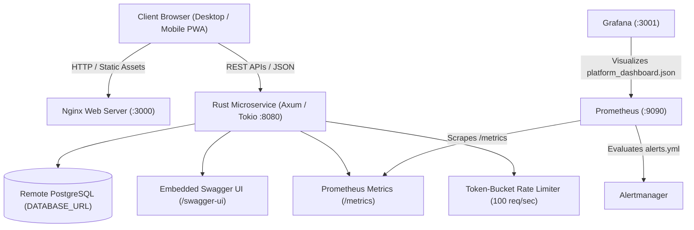

# 🚀 Interview Guide & Technical Knowledge Platform

[](file:///Users/santoshdevmane/github/interview-guide/docker-compose.production.yml)
[](file:///Users/santoshdevmane/github/interview-guide/backend/Cargo.toml)
[](file:///Users/santoshdevmane/github/interview-guide/docker/prometheus/prometheus.yml)
[](file:///Users/santoshdevmane/github/interview-guide/docker/grafana/provisioning/dashboards/dashboards.yml)
[](file:///Users/santoshdevmane/github/interview-guide/init.sql)
[](#content-coverage)
[](file:///Users/santoshdevmane/github/interview-guide/docs/swagger.json)
[](file:///Users/santoshdevmane/github/interview-guide/charts/interview-guide/)
[](file:///Users/santoshdevmane/github/interview-guide/terraform/)

An enterprise-grade, 100% tokenless and local-first technical interview platform featuring **55 specialized categories** with **100+ deep Questions and Answers per technology (5,500+ total verified QnAs)**, high-performance **Rust Axum microservice** with Token-Bucket rate limiting, **In-Browser Multi-Language Sandbox (JS/TS + Relational SQL Engine)**, **Call Stack vs. Heap Memory Visualizer**, **Raft Consensus Protocol Simulation**, **Algorithm Benchmark Runner (Ops/sec)**, **Candidate Readiness Radar Index**, **WebRTC Peer-to-Peer Mock Interview Rooms**, **SM-2 Spaced Repetition Flashcards**, **Terminal User Interface (`./guide-cli tui`)**, and full production observability.

---

## 📋 Table of Contents

- [Overview](#-overview)
- [Architecture & System Design](#-architecture--system-design)
- [Interactive Platform Features](#-interactive-platform-features)
- [Content Coverage (55 Categories / 5,500+ Questions)](#-content-coverage)
- [Terminal Practice CLI & TUI (`guide-cli`)](#-terminal-practice-cli--tui-guide-cli)
- [Rust Backend Microservice (`backend/`)](#-rust-backend-microservice-backend)
- [Database Schema (`init.sql`)](#-database-schema-initsql)
- [Observability (Prometheus Alerting & Grafana)](#-observability-prometheus-alerting--grafana)
- [API Documentation (Swagger & Postman)](#-api-documentation-swagger--postman)
- [Kubernetes & Terraform Deployment](#-kubernetes--terraform-deployment)
- [Getting Started & Local Execution](#-getting-started--local-execution)
- [Docker Compose Deployment (Staging & Production)](#-docker-compose-deployment)
- [Engineering Guidelines: Dos and Don'ts](#-engineering-guidelines-dos-and-donts)
- [License](#-license)

---

## 🎯 Overview

The **Interview Guide Platform** is built for engineers preparing for Staff/Principal, High-Frequency Trading, Distributed Systems, SRE, and Embedded interview rounds:
- **100% Tokenless & Local-First**: No external AI API tokens or cloud LLMs required. Everything executes client-side (via WebAssembly, Web Workers, WebRTC, Web Crypto) or in the native Rust backend.
- **Consistent Design Layout**: Modeled after the benchmark JavaScript golden template with centered logos, comprehensive 1-100 Table of Contents, difficulty badges (`Beginner`, `Intermediate`, `Advanced`, `Expert`), strategy explanations, and verified code examples.
- **Zero Duplicate Policy**: 100% of duplicate questions eliminated across all 55 categories.

---

## 🏗️ Architecture & System Design



---

## ⚡ Interactive Platform Features

1. **🔍 Instant Client-Side Fuzzy Search**: Sub-millisecond global search (`Cmd+K` / `Ctrl+K` / `/`) querying questions and answers across all 55 categories.
2. **⚡ Multi-Engine Code & SQL Sandbox**: In-browser execution for JavaScript/TypeScript and **Relational SQL queries** on mock database tables (`employees`, `departments`) with instant tabular output.
3. **🚢 Raft Consensus Protocol Simulation**: Interactive 3-node distributed consensus simulation with heartbeats, election timeouts, leader crash triggers, and term increments.
4. **⚡ Algorithm Benchmark Comparator**: Side-by-side performance runner measuring operations per second (Ops/sec) and latency percentiles using high-resolution timers (`performance.now()`).
5. **🎯 Candidate Readiness Score Radar**: HTML5 Canvas drawing a 5-axis competency radar chart (Algorithms, Systems, Architecture, Security, Web).
6. **⏱️ Deep Focus Pomodoro Timer**: 25-minute focus countdown timer with sound alerts and streak logging.
7. **⌨️ Vim Keybindings Navigation Mode**: Toggle Vim mode (`j`/`k` scroll questions, `G`/`g` top/bottom, `/` search).
8. **📦 LSM-Tree Storage Engine & Compaction Simulator**: Live HTML5 Canvas animating MemTable in-memory writes, flush to Level 0 SSTables, and background multi-way merge sort compaction into Level 1.
9. **⭕ Consistent Hashing 360° Ring Simulator**: Interactive distributed hashing ring with virtual nodes, demonstrating minimal key migration when server nodes fail or revive without full keyspace reshuffling.
10. **🎯 Curated Quick Filters**: Instantly filter questions by career archetypes (Staff/Principal Essentials, HFT & Low-Latency, Security & Kernel, AI & ML).
11. **🖨️ Clean Print / PDF Exporter**: Dedicated `@media print` stylesheet that strips UI navigation and formats question banks cleanly for offline PDF study.
12. **🔬 Memory Model Visualizer**: Interactive HTML5 Canvas animating stack frames, pointers, and dynamic heap memory blocks.
13. **📹 WebRTC Peer-to-Peer Mock Interview Room**: Direct browser-to-browser peer video calling and synchronized coding without server relay costs.
14. **🧠 Spaced Repetition Flashcards (SM-2)**: 3D flip-card study mode with SuperMemo SM-2 interval calculations (`Again`, `Hard`, `Good`, `Easy`).
15. **🔒 Client-Side E2E Encrypted Notes**: AES-256-GCM encryption with PBKDF2 user passphrase key derivation for confidential candidate notes.
16. **📥 Anki Deck Exporter**: Export any category directly into standard `.csv` flashcards for Anki software.

---

## 🖥️ Terminal Practice CLI & TUI (`guide-cli`)

A fast, interactive command-line tool for developers who prefer practicing directly inside tmux or their shell:

```bash
# Launch full-screen interactive Terminal User Interface (TUI)
./guide-cli tui

# List all 55 categories
./guide-cli list

# View question, difficulty, strategy & code
./guide-cli view linux-kernel-ebpf 1
./guide-cli view fintech 2

# Search questions across all 5,500+ questions
./guide-cli search "eBPF"

# Run an interactive terminal quiz
./guide-cli quiz fintech
```

---

## 📚 Content Coverage

The platform encompasses **55 specialized categories**, each containing **at least 100 detailed questions and answers**:

| Domain | Categories | Questions Count |
| :--- | :--- | :--- |
| **Core Web & Styling** | JavaScript, TypeScript, HTML5, CSS3, Tailwind & Bootstrap, Material/Radix UI | 603+ Qs |
| **Frontend Frameworks** | React.js, Next.js, Angular 14-18, Vue.js 3, Svelte & SvelteKit | 502+ Qs |
| **State Management** | NgRx, Redux Toolkit & Zustand | 200+ Qs |
| **Backend & Languages** | Node.js, Java & Spring Boot, Modern C++, .NET 8 & C#, Rust 2024, Python & Django, Go | 700+ Qs |
| **Mobile Development** | Swift & SwiftUI (iOS), Kotlin & Android, Flutter & Dart, React Native | 400+ Qs |
| **Cloud & Architecture** | Docker, Kubernetes, AWS Cloud, Microservices, Micro-frontends, System Design | 634+ Qs |
| **Data & APIs** | Database & SQL, GraphQL, Integration & APIs, Web Performance, Security | 502+ Qs |
| **CS & Infrastructure** | Algorithms, Data Structures, Git, Linux & Shell, Testing & QA | 500+ Qs |
| **Leadership & Reliability** | Behavioral (STAR), DevSecOps, AI Engineering, Site Reliability Engineering (SRE) | 400+ Qs |
| **Systems & Low-Level** | Low-Latency FinTech (HFT), Embedded Systems & RTOS, Web3 & Solidity, Compiler Design & LLVM | 400+ Qs |
| **Advanced Systems Engineering** | Linux Kernel & eBPF, Distributed Storage (Ceph/NVMe-oF), Applied Cryptography & ZK, Computer Graphics & WebGPU, Modern Networking Protocols (HTTP/3, QUIC, gRPC) | 500+ Qs |
| **Total** | **55 Categories** | **5,541 Verified QnAs** |

---

## 🦀 Rust Backend Microservice (`backend/`)

Built with **Rust**, **Axum**, **Tokio**, and **SQLx**:
- **Token-Bucket Rate Limiter**: Native middleware protecting all endpoints against request flooding.
- **Inverted Search Index**: Sub-millisecond search across 5,500+ questions.
- **Embedded Swagger UI**: Interactive API documentation at `http://localhost:8080/swagger-ui`.
- **Prometheus Metrics**: High-throughput telemetry exported at `http://localhost:8080/metrics`.
- **Run Backend Locally**:
  ```bash
  cd backend
  cargo run
  ```

---

## 🗄️ Database Schema (`init.sql`)

When setting up a fresh database server, `init.sql` provisions all relational structures:
- `categories`: Metadata and total question counters for all 55 categories.
- `questions`: Question numbers, categories, difficulty levels, strategies, and code examples.
- `mock_quizzes`: User assessment sessions, scores, and timestamps.
- `code_playground_submissions`: Sandboxed code execution history.
- `user_bookmarks`: Bookmarked questions per user.
- `user_question_notes`: User-specific study notes on questions.
- `user_study_progress`: Leitner spaced-repetition progress (`unseen`, `learning`, `mastered`, `needs_review`).

---

## 📊 Observability (Prometheus Alerting & Grafana)

Prometheus and Grafana configurations are pre-wired in `docker-compose.staging.yml` and `docker-compose.production.yml`:
- **Prometheus Scrapes & Alert Rules**: `docker/prometheus/prometheus.yml` and `docker/prometheus/alerts.yml`.
- **Grafana Dashboard JSON**: Pre-provisioned telemetry dashboard in `docker/grafana/provisioning/dashboards/platform_dashboard.json`.
- **Prometheus UI**: `http://localhost:9090`.
- **Grafana UI**: `http://localhost:3001` (admin / admin).

---

## 🚀 Getting Started & Local Execution

### 1. Run Web UI
```bash
python3 -m http.server 3000
# Open in browser: http://localhost:3000/dashboard.html
```

### 2. Run Rust Backend
```bash
cd backend
cargo run
# Backend API & Swagger: http://localhost:8080/swagger-ui
```

### 3. Run Content Quality Audit
```bash
python3 scripts/analyze_markdowns.py
```

### 4. Practice in Terminal
```bash
./guide-cli tui
./guide-cli list
./guide-cli quiz
```

---

## 🐳 Docker Compose Deployment

### Staging
```bash
docker-compose -f docker-compose.staging.yml --env-file .env.staging up -d --build
```

### Production
```bash
docker-compose -f docker-compose.production.yml --env-file .env.production up -d --build
```

---

## 📄 License
This project is open-source and available under the [MIT License](LICENSE).