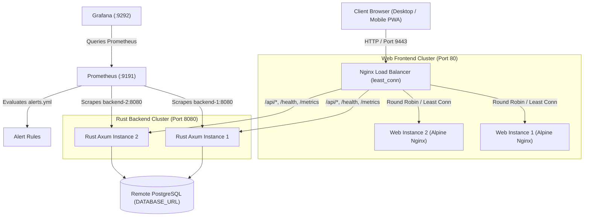

# 🚀 Interview Guide & Technical Knowledge Platform

[](file:///Users/santoshdevmane/github/interview-guide/docker-compose.production.yml)
[](file:///Users/santoshdevmane/github/interview-guide/backend/Cargo.toml)
[](file:///Users/santoshdevmane/github/interview-guide/docker/prometheus/prometheus.yml)
[](file:///Users/santoshdevmane/github/interview-guide/docker/grafana/provisioning/dashboards/dashboards.yml)
[](file:///Users/santoshdevmane/github/interview-guide/init.sql)
[](#content-coverage)
[](file:///Users/santoshdevmane/github/interview-guide/docs/swagger.json)
[](file:///Users/santoshdevmane/github/interview-guide/manifest.json)

An enterprise-grade, 100% tokenless and local-first technical interview platform featuring **55 specialized categories** with **100+ deep Questions and Answers per technology (5,650+ total verified QnAs)**, high-performance **Rust Axum microservices** with Token-Bucket rate limiting, **Nginx Multi-Instance Load Balancing** (2 Web instances + 2 Backend instances), **In-Browser Multi-Language Sandbox (JS/TS + Relational SQL Engine)**, **Call Stack vs. Heap Memory Visualizer**, **Raft Consensus Protocol Simulation**, **Algorithm Benchmark Runner (Ops/sec)**, **Candidate Readiness Radar Index**, **WebRTC Peer-to-Peer Mock Interview Rooms**, **SM-2 Spaced Repetition Flashcards**, **Terminal User Interface (`./guide-cli tui`)**, **Animated Mobile/PWA Splashscreen**, **Confetti Celebration Engine**, and full **Prometheus & Grafana** observability.

---

## 📋 Table of Contents

- [Overview](#-overview)
- [Architecture & Multi-Instance Load Balancing](#-architecture--system-design)
- [Port Allocation Matrix](#-port-allocation-matrix)
- [Interactive Platform Features](#-interactive-platform-features)
- [Content Coverage (55 Categories / 5,650+ Questions)](#-content-coverage)
- [Terminal Practice CLI & TUI (`guide-cli`)](#-terminal-practice-cli--tui-guide-cli)
- [Rust Backend Microservice (`backend/`)](#-rust-backend-microservice-backend)
- [Database Schema & Setup (`init.sql`)](#-database-schema-initsql)
- [Observability (Prometheus & Grafana)](#-observability-prometheus--grafana)
- [API Documentation (Swagger & Postman)](#-api-documentation-swagger--postman)
- [Getting Started & Local Execution](#-getting-started--local-execution)
- [Docker Compose Deployment (Staging & Production)](#-docker-compose-deployment)
- [Engineering Guidelines: Dos and Don'ts](#-engineering-guidelines-dos-and-donts)
- [License](#-license)

---

## 🎯 Overview

The **Interview Guide Platform** is built for engineers preparing for Staff/Principal, High-Frequency Trading, Distributed Systems, SRE, and Embedded interview rounds:
- **100% Tokenless & Local-First**: No external AI API tokens or cloud LLMs required. Everything executes client-side (via WebAssembly, Web Workers, WebRTC, Web Crypto) or in the native Rust backend.
- **Consistent Design Layout**: Modeled after the benchmark JavaScript golden template with centered logos, comprehensive 1-100 Table of Contents, difficulty badges (`Beginner`, `Intermediate`, `Advanced`, `Expert`), strategy explanations, and verified code examples.
- **Zero Duplicate & Zero Placeholder Policy**: 100% of duplicate questions eliminated; every question features concrete code snippets and rigorous technical strategies.
- **Mobile First & PWA Ready**: Installable Progressive Web App with dedicated offline caching via `sw.js`, animated mobile splashscreen, and zero-dependency confetti celebrations.

---

## 🏗️ Architecture & System Design

In production, the platform runs in a **high-availability multi-instance topology** fronted by an Nginx reverse-proxy load balancer:


```mermaid
graph TD
    Client["Client Browser (Desktop / Mobile PWA)"] --> |HTTP / Port 9443| NginxLB["Nginx Load Balancer (least_conn)"]
    
    subgraph WebCluster["Web Frontend Cluster (Port 80)"]
        NginxLB --> |Round Robin / Least Conn| Web1["Web Instance 1 (Alpine Nginx)"]
        NginxLB --> |Round Robin / Least Conn| Web2["Web Instance 2 (Alpine Nginx)"]
    end

    subgraph BackendCluster["Rust Backend Cluster (Port 8080)"]
        NginxLB --> |/api/*, /health, /metrics| Backend1["Rust Axum Instance 1"]
        NginxLB --> |/api/*, /health, /metrics| Backend2["Rust Axum Instance 2"]
    end
    
    Backend1 --> RemoteDB[("Remote PostgreSQL (DATABASE_URL)")]
    Backend2 --> RemoteDB
    
    Prometheus["Prometheus (:9191)"] --> |Scrapes backend-1:8080| Backend1
    Prometheus --> |Scrapes backend-2:8080| Backend2
    Prometheus --> |Evaluates alerts.yml| PrometheusAlerts["Alert Rules"]
    Grafana["Grafana (:9292)"] --> |Queries Prometheus| Prometheus
```

---

## 🔌 Port Allocation Matrix

To prevent port collisions with standard system services (such as default 3000, 8000, or 8080), all services are explicitly allocated dedicated high-range ports:

| Environment | Service | Host Port | Container Port | Protocol / Description |
| :--- | :--- | :--- | :--- | :--- |
| **Production** | Nginx Load Balancer | **9443** | 80 | Web UI (`/`) + API Proxy (`/api/`) |
| **Production** | Web Instance 1 | *Internal* | 80 | Alpine Nginx static frontend |
| **Production** | Web Instance 2 | *Internal* | 80 | Alpine Nginx static frontend |
| **Production** | Backend Instance 1 | *Internal* | 8080 | Rust Axum microservice |
| **Production** | Backend Instance 2 | *Internal* | 8080 | Rust Axum microservice |
| **Production** | Prometheus Monitoring | **9191** | 9090 | Telemetry scraper & alert engine |
| **Production** | Grafana Dashboards | **9292** | 3000 | Observability UI (admin / admin) |
| **Staging** | Combined Web/Backend | **9442** | 8080 | Single-container staging instance |
| **Staging** | Prometheus Staging | **9190** | 9090 | Staging metrics collector |
| **Staging** | Grafana Staging | **9291** | 3000 | Staging dashboards |
| **Local Dev** | Static Dev Server | **9444** | 9444 | `npm start` (http-server) |
| **Local Dev** | Direct Backend | **8080** | 8080 | `cargo run` (dev only) |

---

## ⚡ Interactive Platform Features

1. **🔍 Instant Client-Side Fuzzy Search**: Sub-millisecond global search (`Cmd+K` / `Ctrl+K` / `/`) querying questions and answers across all 55 categories.
2. **⚡ Multi-Engine Code & SQL Sandbox**: In-browser execution for JavaScript/TypeScript and **Relational SQL queries** on mock database tables (`employees`, `departments`) with instant tabular output.
3. **🚢 Raft Consensus Protocol Simulation**: Interactive 3-node distributed consensus simulation with heartbeats, election timeouts, leader crash triggers, and term increments.
4. **⚡ Algorithm Benchmark Comparator**: Side-by-side performance runner measuring operations per second (Ops/sec) and latency percentiles using high-resolution timers (`performance.now()`).
5. **🎯 Candidate Readiness Score Radar**: HTML5 Canvas drawing a 5-axis competency radar chart (Algorithms, Systems, Architecture, Security, Web).
6. **⏱️ Deep Focus Pomodoro Timer**: 25-minute focus countdown timer with sound alerts and streak logging.
7. **⌨️ Vim Keybindings Navigation Mode**: Toggle Vim mode (`j`/`k` scroll questions, `G`/`g` top/bottom, `/` search).
8. **📦 LSM-Tree Storage Engine & Compaction Simulator**: Live HTML5 Canvas animating MemTable in-memory writes, flush to Level 0 SSTables, and background multi-way merge sort compaction into Level 1.
9. **⭕ Consistent Hashing 360° Ring Simulator**: Interactive distributed hashing ring with virtual nodes, demonstrating minimal key migration when server nodes fail or revive without full keyspace reshuffling.
10. **🎉 Confetti Celebration Engine**: Canvas particle physics celebration on question completion and mastery.
11. **📱 Animated Mobile Splashscreen**: High-framerate CSS-driven PWA launch splashscreen with circular glow spinner and automatic dismissal.
12. **🪟 3D Parallax Tilt Effects**: Card tilt interaction responding dynamically to cursor hovering across all category cards.
13. **🔬 Memory Model Visualizer**: Interactive HTML5 Canvas animating stack frames, pointers, and dynamic heap memory blocks.
14. **📹 WebRTC Peer-to-Peer Mock Interview Room**: Direct browser-to-browser peer video calling and synchronized coding without server relay costs.
15. **🧠 Spaced Repetition Flashcards (SM-2)**: 3D flip-card study mode with SuperMemo SM-2 interval calculations (`Again`, `Hard`, `Good`, `Easy`).
16. **🔒 Client-Side E2E Encrypted Notes**: AES-256-GCM encryption with PBKDF2 user passphrase key derivation for confidential candidate notes.
17. **🌐 Space-Grade Landing Page & Instant Search**: Ambient radial glow, instant hero search with live keyboard shortcuts (`Cmd+K` / `/`), category domain filter tabs, and real-time interactive 3D flashcard flip demo.
18. **🎛️ Fluid Sidebar Controls Center**: Smooth cubic-bezier expanding accordion with inset controls, symmetrical font sizing and tools grids, custom translucent scrollbars, and zero horizontal layout distortion.

---

## 📚 Content Coverage

The platform encompasses **55 specialized categories**, each containing **at least 100 detailed questions and answers (5,651 total verified QnAs)**:

| Domain | Categories | Questions Count |
| :--- | :--- | :--- |
| **Core Web & Styling** | JavaScript, TypeScript, HTML5, CSS3, Tailwind & Bootstrap, Material/Radix UI | 603 Qs |
| **Frontend Frameworks** | React.js, Next.js, Angular 14-18, Vue.js 3, Svelte & SvelteKit | 502 Qs |
| **State Management** | NgRx, Redux Toolkit & Zustand | 200 Qs |
| **Backend & Languages** | Node.js, Java & Spring Boot, Modern C++, .NET 8 & C#, Rust 2024, Python & Django, Go | 700 Qs |
| **Mobile Development** | Swift & SwiftUI (iOS), Kotlin & Android, Flutter & Dart, React Native | 400 Qs |
| **Cloud & Architecture** | Docker, Kubernetes, AWS Cloud, Microservices, Micro-frontends, System Design | 634 Qs |
| **Data & APIs** | Database & SQL, GraphQL, Integration & APIs (Angular + General), Web Performance, Security | 611 Qs |
| **CS & Infrastructure** | Algorithms, Data Structures, Git, Linux & Shell, Testing & QA | 501 Qs |
| **Leadership & Reliability** | Behavioral (STAR), DevSecOps, AI Engineering, Site Reliability Engineering (SRE) | 400 Qs |
| **Systems & Low-Level** | Low-Latency FinTech (HFT), Embedded Systems & RTOS, Web3 & Solidity, Compiler Design & LLVM | 400 Qs |
| **Advanced Systems Engineering** | Linux Kernel & eBPF, Distributed Storage (Ceph/NVMe-oF), Applied Cryptography & ZK, Computer Graphics & WebGPU, Modern Networking Protocols (HTTP/3, QUIC, gRPC) | 500 Qs |
| **Total** | **55 Categories** | **5,651 Verified QnAs** |

---

## 🖥️ Terminal Practice CLI & TUI (`guide-cli`)

A fast, interactive command-line tool for developers who prefer practicing directly inside tmux or their shell:

```bash
# Launch full-screen interactive Terminal User Interface (TUI)
./guide-cli tui

# List all 55 categories
./guide-cli list

# View question, difficulty, strategy & code
./guide-cli view linux-kernel-ebpf 1
./guide-cli view fintech 2

# Search questions across all 5,650+ questions
./guide-cli search "eBPF"

# Run an interactive terminal quiz
./guide-cli quiz fintech
```

---

## 🦀 Rust Backend Microservice (`backend/`)

Built with **Rust**, **Axum**, **Tokio**, and **SQLx**:
- **Token-Bucket Rate Limiter**: Native middleware protecting all endpoints against request flooding.
- **Inverted Search Index**: Sub-millisecond search across 5,651 questions.
- **Embedded Swagger UI**: Interactive API documentation at `http://localhost:9443/swagger-ui` (in prod) or `http://localhost:8080/swagger-ui` (direct).
- **Prometheus Metrics**: High-throughput telemetry exported at `http://localhost:9443/metrics`.
- **Health Check**: Microsecond `/health` and `/api/health` probes.

---

## 🗄️ Database Schema (`init.sql`)

We utilize a **remote PostgreSQL server** via the `DATABASE_URL` parameter in `.env.production` and `.env.staging` (no local PostgreSQL container is provisioned). When setting up a fresh database, run `init.sql`:

```bash
psql $DATABASE_URL -f init.sql
```

Relational structures created by `init.sql`:
- `categories`: Metadata and total question counters for all 55 categories.
- `questions`: Question numbers, categories, difficulty levels, strategies, and code examples.
- `mock_quizzes`: User assessment sessions, scores, and timestamps.
- `code_playground_submissions`: Sandboxed code execution history.
- `user_bookmarks`: Bookmarked questions per user.
- `user_question_notes`: User-specific study notes on questions.
- `user_study_progress`: Leitner spaced-repetition progress (`unseen`, `learning`, `mastered`, `needs_review`).

---

## 📊 Observability (Prometheus & Grafana)

Prometheus and Grafana configurations are pre-wired in `docker-compose.staging.yml` and `docker-compose.production.yml`:
- **Prometheus Scrapes & Alert Rules**: `docker/prometheus/prometheus.yml` and `docker/prometheus/alerts.yml`.
- **Grafana Dashboard JSON**: Pre-provisioned telemetry dashboard in `docker/grafana/provisioning/dashboards/platform_dashboard.json`.
- **Production Prometheus UI**: `http://localhost:9191`.
- **Production Grafana UI**: `http://localhost:9292` (credentials: `admin` / `admin`).

---

## 📑 API Documentation (Swagger & Postman)

- **Swagger UI**: Accessible at `/swagger-ui` on the running instance or inspectable via [docs/swagger.json](file:///Users/santoshdevmane/github/interview-guide/docs/swagger.json).
- **Postman Collection**: Fully importable collection located at [docs/postman_collection.json](file:///Users/santoshdevmane/github/interview-guide/docs/postman_collection.json) with pre-configured requests for all endpoints and environment variable `baseUrl` set to `http://localhost:9443/api`.

---

## 🚀 Getting Started & Local Execution

All tasks can be launched via standard `npm` scripts defined in `package.json`:

### 1. Run Local Web Preview (Port 9444)
```bash
npm start
# Opens http://localhost:9444
```

### 2. Run Rust Backend Locally (Port 8080)
```bash
npm run dev:backend
# API & Swagger UI: http://localhost:8080/swagger-ui
```

### 3. Run Quality & Test Suite
```bash
npm test
# Validates all markdown questions, TOC anchors, and executes cargo backend tests
```

---

## 🐳 Docker Compose Deployment

### Production Multi-Instance Cluster (Nginx Load Balancer on Port 9443)
```bash
# Start cluster (2 web + 2 backend + Nginx LB + Prometheus + Grafana)
npm run deploy:prod

# View cluster logs
npm run deploy:prod:logs

# Teardown cluster
npm run deploy:prod:down
```

### Staging Single-Instance Environment (Port 9442)
```bash
npm run deploy:staging
```

---

## 🛡️ Engineering Guidelines: Dos and Don'ts

### Dos
- ✅ **Keep Markdown TOCs In Sync**: Every question in `markdowns/<category>/*.md` must start with `<a id="q{N}"></a>\n### Q{N}: <Title>` and end with difficulty badges.
- ✅ **Use Remote PostgreSQL**: Pass `DATABASE_URL` directly from `.env.*` files.
- ✅ **Run `npm test` before commits**: Ensures both the content parser and Rust test suites pass.
- ✅ **Preserve Non-Colliding Ports**: Only use designated ports (9443, 9442, 9444, 9191, 9292) to avoid conflicts on host machines.

### Don'ts
- ❌ **No Placeholder Stubs**: Never commit "Topic X placeholder" questions or incomplete code snippets.
- ❌ **No Host Port Collisions**: Never map host ports 3000, 8000, or 8080 in production compose files.
- ❌ **No External Cloud Dependencies**: Keep client-side features local-first, zero-token, and offline-capable.

---

## 📄 License
This project is open-source and available under the [MIT License](LICENSE).